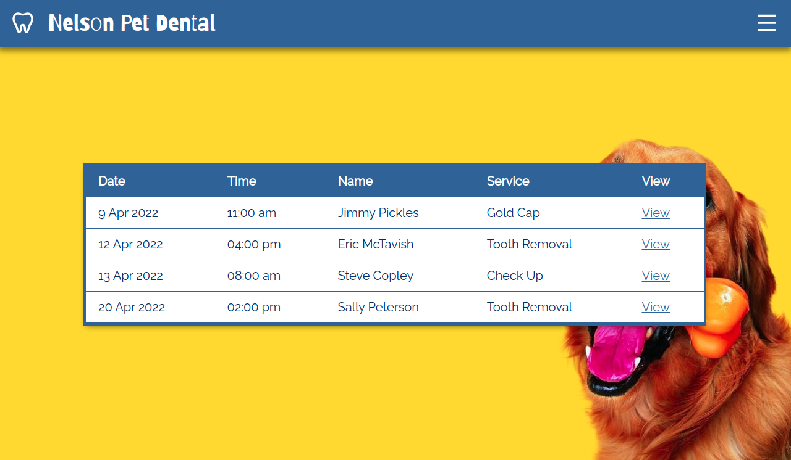
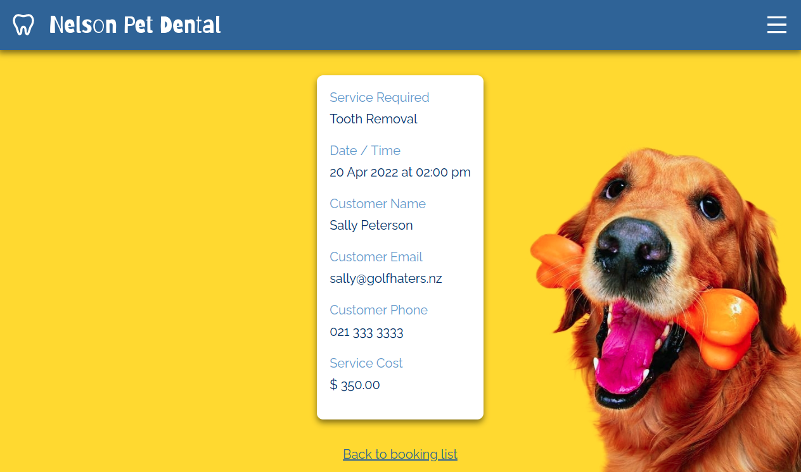

# Demo Project - Bookings System

Demonstrates: 

- Some CRUD functionality:
   - Creation of new data
   - Reading of existing data
   - (No Updating of data)
   - (No Deletion of data)
- Relational DB queries
   - Queries from individual tables
   - Queries with JOINs from both
- Crude security for admin features
  - Password page (hard-coded)

Site has a simple but responsive UI, including:
- mobile-first design
- lists of services and bookings
- expanded team details view
- pop-in menu

## Screenshots

Home Page

Main Menu

List of Services

Home Page on Mobile

List of Services on Mobile

New Booking (without having first selected a service)

New Booking (having first selected a service)

### Admin Features

Admin Password

View All Bookings

Booking Details

